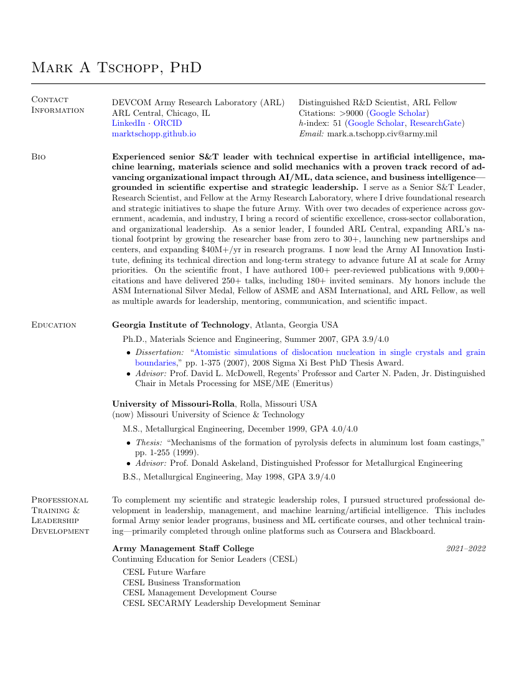

# Academic CV — Mark Tschopp, PhD

The LaTeX source for my academic CV — and a reusable template, if you'd like to build your own.

📄 **[Download the compiled PDF](tschopp-cv.pdf)** &nbsp;·&nbsp; 🔗 **[my live CV](https://marktschopp.github.io/Tschopp-CV.pdf)** &nbsp;·&nbsp; 🌐 **[marktschopp.github.io](https://marktschopp.github.io)**

<p align="center">
  <a href="tschopp-cv.pdf"></a>
</p>

## Why this is public

People occasionally ask how I format my CV, so here's the full source. It's built on the classic `res` LaTeX class with a modular structure I've refined over the years — one file per section, assembled by a short main document. Borrow the format, the section layout, or the whole thing as a starting point for your own.

## Building it

Requires a LaTeX distribution (TeX Live, MiKTeX, MacTeX). From the project root:

```bash
pdflatex tschopp-cv.tex
pdflatex tschopp-cv.tex   # second pass resolves cross-references
```

Output: `tschopp-cv.pdf`.

## Structure

| File | What it is |
|---|---|
| `tschopp-cv.tex` | Main document — preamble, contact block, and the section includes |
| `res.cls`, `res.sty` | The résumé document class and styling |
| `src/01-education.tex` … `src/16-service.tex` | One file per CV section, included in order |

Tailoring the CV for a specific purpose is as simple as commenting or uncommenting `\include{}` lines in the main file — each section is self-contained, so you can reorder or drop sections without touching the rest.

## The comment layer

One reason I keep my CV in LaTeX: everything after a `%` is invisible in the compiled PDF but travels with the source. That turns the comments into a **private annotation track running alongside the public record** — a place to keep the logistics behind each line that would never belong on a CV you hand to someone else.

A few things worth tracking there:

- **Publications** — the full lifecycle of each paper: submitted → reviews back → revision resubmitted → accepted → online. Over time this shows how long each *journal* actually takes.
- **Reviewing** — the public CV lists the journals you review for; the comments can hold which manuscript, when, and what you recommended. (Keep real review records private — reviewer confidentiality.)
- **Proposals** — submitted vs. funded, including the ones that didn't land and a note on why.

To make the layer more than notes, this template uses a small **greppable tag convention** — `@pub`, `@review`, `@proposal` with `key=value` fields — so the comments double as a dataset you can parse later (e.g., median time-to-acceptance by journal, or proposal hit rate). See the tagged examples in `src/06-journals.tex`, `src/15-research-programs.tex`, and `src/16-service.tex`.

> **The examples in this public repo are entirely fictional.** The real annotations live only in my private copy — which is rather the point.

## A note on reuse

The formatting and structure are free to reuse under the [MIT License](LICENSE). The *content* — my education, publications, and so on — is mine; swap in your own.

Built on the `res` document class by Michael DeCorte, with customizations of my own.
